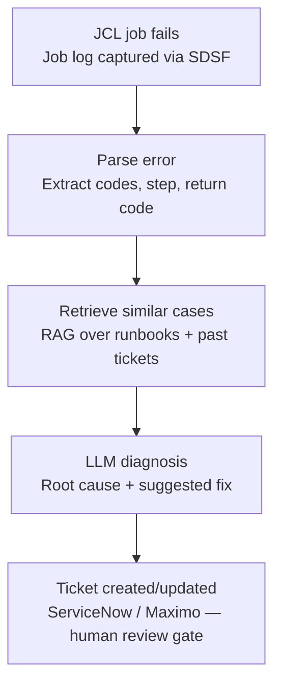

# AI Engineering Lab

A structured learning journey through AI concepts, embeddings, vector databases, RAG systems, MCP servers, and agentic orchestration—taught one concept and one validated action at a time.

**Learner profile:** Seasoned z/OS programmer with Python and AWS knowledge, learning AI/ML, embeddings, vector databases, and modern agent patterns.

**Format:** 4-hour days, 6 focused slices of 30–60 minutes each. One concept, one experiment, one commit per day.

## Featured experiments

### JCL error analysis → ticketing system

A z/OS batch job fails. Instead of a human manually tracing the JCL log, cross-referencing runbooks, and opening a ticket by hand, this architecture automates the first three steps — and stops for human approval before anything touches production.



This maps directly onto the five pillars this repo tracks — **B**rain, **O**rchestration, **T**ools, **M**emory, **S**upervise (see [BOTMS framework](.github/agents/ai-engineering-lab-mentor.agent.md)): the diagnosis step is the model reasoning over the failure, the runbook retrieval is the indexing work built in Days 1–2, ServiceNow/Maximo is the external tool integration, and — critically — nothing auto-resolves without a human reviewing the suggested fix first.

*Status: architecture defined, implementation in progress — see [progress log](memories/repo/ai-engineering-lab-progress.md).*

## Quick Start

1. **Review the teaching approach:** Read [`.github/agents/ai-engineering-lab-mentor.agent.md`](.github/agents/ai-engineering-lab-mentor.agent.md) for the full curriculum philosophy, error recovery, and pacing.

2. **Check today's progress:** See [`/memories/repo/ai-engineering-lab-progress.md`](memories/repo/ai-engineering-lab-progress.md) for completed concepts and what's next.

3. **Clone and setup:**

```
git clone <repo-url>
cd ai-engineering-lab
python -m venv venv
source venv/bin/activate  # on Windows: venv\Scripts\activate
pip install -r requirements.txt
python -m pytest
```

4. **Begin Day 1:**

```
git switch -c day-01-foundations
cd daily-labs/day-01-foundations
cat README.md
```

## Repository Structure

```
ai-engineering-lab/
├── .github/
│   ├── agents/
│   │   └── ai-engineering-lab-mentor.agent.md     # Teaching methodology
│   ├── copilot-instructions.md                    # Lab constraints and safety
│   ├── pull_request_template.md                   # Daily learning PR format
│   └── ISSUE_TEMPLATE/
│       └── lab-improvement.md                     # Future experiment template
├── daily-labs/
│   ├── day_01_foundations/                        # Local search baseline
│   │   ├── README.md                              # Day 1 objective and steps
│   │   ├── search.py                              # Core search implementation
│   │   ├── test_search.py                         # Unit tests
│   │   └── fixtures/                              # Test data
│   ├── day_02_persistence/                        # SQLite-backed index + filtering
│   └── ...
├── src/ai_lab/                                    # Shared code library
│   ├── __init__.py
│   ├── search.py                                  # Reusable retrieval logic
│   ├── data.py                                    # Data loading and validation
│   └── utils.py                                   # Common helpers
├── integrations/                                  # Provider-specific code
│   ├── __init__.py
│   ├── mongodb.py                                 # (added later)
│   └── openai.py                                  # (added later)
├── memories/
│   ├── repo/
│   │   └── ai-engineering-lab-progress.md        # Progress tracking and memory
│   └── session/                                   # (used during live sessions)
├── .env.example                                   # Required env vars (names only)
├── .gitignore                                     # Safety: ignore .env, __pycache__, *.db, etc.
├── requirements.txt                               # Core dependencies
├── requirements-dev.txt                           # Dev tools: pytest, ruff
└── README.md                                      # This file
```

## Daily Workflow

Each day follows this rhythm (adapt to your pace):

1. **00:00–00:30:** Review yesterday's commit and define today's question.
2. **00:30–01:30:** Learn one concept and inspect a small example.
3. **01:30–02:30:** Implement one narrow experiment.
4. **02:30–03:15:** Test, measure, and inspect failure cases.
5. **03:15–03:45:** Write notes and update the day's README.
6. **03:45–04:00:** Commit the day's work and record the next question.

**Before pushing:**

```
python -m pytest
ruff check .
git status
```

**Merge and tag:**

```
git switch main
git pull --ff-only
git merge day-01-foundations
git tag day-01-complete -m "local search baseline with BM25 scoring and 3 failure cases"
git push origin main --tags
```

## Concepts and Progression

**Phase 1: Local Foundations**

- [x] **Day 1:** Local search baseline (inverted index, BM25, synthetic documents)
- [x] **Day 2:** Persistence and SQL (SQLite schema, filtering, joins)

**Phase 2: Vector Embeddings and Retrieval**

- [ ] **Day 3:** Compute embeddings locally (pretrained model, vector representation)
- [ ] **Day 4:** Vector similarity and nearest-neighbor search (cosine similarity, top-k retrieval)

**Phase 3: Databases and Integration**

- [ ] **Day 5:** MongoDB and Atlas (document storage, indexing, filtering)
- [ ] **Day 6:** MongoDB + vector search (Atlas Search, hybrid retrieval)

**Phase 4: Model Integration and RAG**

- [ ] **Day 7:** Model interface (OpenAI API, input/output validation, error handling)
- [ ] **Day 8:** Basic RAG (retrieval + generation, citation preservation)

**Phase 5: Evaluation and Optimization**

- [ ] **Day 9:** Evaluation metrics (precision, recall, semantic similarity)
- [ ] **Day 10:** Cost and latency analysis (trade-off study, local vs. cloud)

**Phase 6: Enterprise Integration (optional, learner-driven)**

- [ ] Jira as a read-only knowledge source
- [ ] z/OS job submission via Zowe (synthetic records only)
- [ ] JCL error analysis → ServiceNow/Maximo ticketing (see Featured experiments above)
- [ ] AWS or GCP comparison

## Safety and Constraints

- **Synthetic data only.** All documents, Jira tickets, and z/OS records are fabricated for testing.
- **No credentials in repo.** Use `.env` for secrets (not committed). See `.env.example`.
- **Read-only first.** Always start with read-only access to external systems.
- **Preserve provenance.** Every data item tracks its source, access label, and citations.
- **Cost tracking.** Document cost, quota, and timeout assumptions before using cloud services.

See [`.github/copilot-instructions.md`](.github/copilot-instructions.md) for full constraints.

## Get Help

- **Stuck on a concept?** Review the prior day's merged PR (link in progress file) and run its reproduction command.
- **Error or test failure?** Run `python -m pytest -v` and read the traceback. Isolate the smallest failing test.
- **Lost context?** Check `/memories/repo/ai-engineering-lab-progress.md` for what was learned, what's active, and what's next.
- **Environment issue?** Run `python --version`, `pytest --version`, `ruff --version`, and `git --version` to verify tools.

## License

This lab is a learning exercise. Shared code is provided as-is for educational purposes.

---

**Ready to start?** Move to [Day 1: Foundations](daily-labs/day_01_foundations/README.md).
